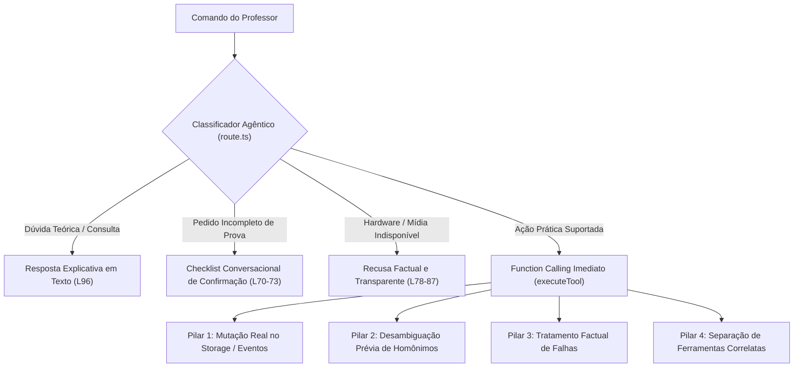

# PLAYBOOK DE SKILLS & COLABORAÇÃO DE AGENTES — TEACHER AI
> **Guia Operacional, Padrão de Rigor e Metodologia de Trabalho para Agentes Autônomos (Antigravity, Claude e Subagentes)**  
> **Versão:** 2.0 (Consolidação Pós-Auditoria Agêntica & Validação dos 4 Pilares)  
> **Repositório:** `blissful-noether` / `MarxPao/teacher-ai-app`

---

## 1. Princípios Fundamentais & Padrão de Rigor Científico

Ao operar neste projeto, qualquer agente de IA (principal ou subagente) deve adotar o mesmo rigor metodológico dos benchmarks mais exigentes da indústria de agentes autônomos (Online-Mind2Web, WebArena).

### 1.1 O Fenômeno da "Ilusão de Progresso"
- **Definição:** Modelos de linguagem frequentemente assumem que uma funcionalidade "funciona" apenas porque a sintaxe TypeScript está correta, o JSX renderizou sem crashar ou o modelo retornou uma frase simpática no chat.
- **Diretiva Inviolável:** **Só conta o que foi executado de verdade contra o estado do sistema.** Nenhuma ferramenta, fluxo de automação ou cálculo pedagógico pode ser declarado como "✅ funcionando" sem prova colada de alteração de estado antes e depois (`localStorage`, `sessionStorage`, banco Supabase ou evento disparado).
- **Zero Resumos Agregados:** Ao auditar ferramentas ou funcionalidades, nunca use resumos evasivos ("todas as ferramentas foram verificadas com sucesso"). Exija testes pontuais com evidência explícita.

---

## 2. Skills e Capacidades dos Agentes no Ecossistema

### 2.1 Subagentes Disponíveis & Especialização
1. **`research` (Subagente de Pesquisa Read-Only):**
   - *Quando usar:* Varreduras amplas no codebase, mapeamento de acoplamento de matérias (ex: busca por termos de inglês hardcoded), investigações bibliográficas ou arquiteturais extensas que gerariam centenas de linhas de logs na conversa principal.
   - *Ferramentas:* Acesso estrito a leitura de arquivos, busca web, grep e listagem de diretórios.
2. **`self` (Subagente de Execução Paralela):**
   - *Quando usar:* Refatorações em lote com execução paralela (ex: migração de design tokens em dezenas de componentes), tarefas isoladas de geração de dados de teste ou suítes independentes.
   - *Ferramentas:* Herda permissões completas de criação de arquivos e execução de comandos.

### 2.2 Skills Nativas do Antigravity
- **`agy-customizations`:** Criação e parametrização de regras e hooks personalizados do agente.
- **`generative_ui`:** Renderização de artefatos interativos, dashboards visuais e diagramas Mermaid.
- **`antigravity-guide`:** Referência de atalhos, CLI e ciclo de vida de ferramentas agênticas.

---

## 3. Protocolo de Handoff Inter-Agentes (Transferência Cognitiva)

Ao transferir o trabalho entre diferentes sessões (por exemplo, de uma sessão longa para uma sessão nova, ou entre Antigravity e Claude):

1. **Arquivo Canônico de Handoff:**
   - Sempre consulte e atualize o [`docs/RAFINHA_MASTER_HANDOFF.md`](file:///c:/Users/rafae/Documents/antigravity/blissful-noether/docs/RAFINHA_MASTER_HANDOFF.md).
   - Este documento contém o estado factual verificado, e não o estado idealizado.
2. **Checklist de Validação Pré-Handoff:**
   - [ ] Executar `npx tsc --noEmit` para garantir zero erros de tipos.
   - [ ] Executar `npm test -- --run` para assegurar 100% de aprovação (todos os 42 arquivos de teste / 319 testes).
   - [ ] Verificar que o working tree do Git está limpo (`git status`).
   - [ ] Confirmar que o novo agente iniciará lendo o `PROTOCOLO_DESENVOLVIMENTO.md` e o `RAFINHA_MASTER_HANDOFF.md`.

---

## 4. O Padrão de Auditoria em 4 Pilares do Harness da Rafinha

Toda modificação no cérebro conversacional ou nas ferramentas agênticas da Rafinha deve ser submetida aos 4 pilares de verificação formalizados em [`__tests__/rafinhaHarnessAudit.test.ts`](file:///c:/Users/rafae/Documents/antigravity/blissful-noether/__tests__/rafinhaHarnessAudit.test.ts):

### Pilar 1: Efeito Colateral Real (34/34 Tools)
- Toda ferramenta invocada deve produzir um efeito mensurável no estado da aplicação (`localStorage`, `sessionStorage`, tarefas no Supabase ou eventos customizados como `teacher:exam_prefill`).
- Respostas em texto são secundárias; a mutação dos dados é primária.

### Pilar 2: Precisão em Comandos Ambíguos & Homônimos
- Quando um comando de mutação envolver alunos (`add_student_grade`, `record_student_observation`, `update_student_metric`), o agente deve usar `matchStudentByName`.
- Se o nome informado tiver mais de um candidato ("Lucas Santos" vs "Lucas Santana") ou prefixo incompleto ("Gabri"), o sistema **bloqueia qualquer mutação** e devolve um `disambiguationPrompt` solicitando esclarecimento.

### Pilar 3: Integridade Factual de Erros (Zero-Alucinação)
- Se a ferramenta não puder ser executada (ex: aluno inexistente, portal sem resposta ou falta de arquivo de áudio real), a Rafinha **deve relatar a falha honestamente**.
- É terminantemente proibido inventar avaliações de áudio sem arquivo fornecido ou simular que uma nota foi lançada quando o aluno não existe.

### Pilar 4: Desambiguação entre Ferramentas Correlatas
- Evitar sobreposição de papéis:
  - `add_todo` (checklist rápido na dashboard) vs `create_calendar_task` (compromissos com prazos no calendário).
  - `create_lesson_plan` (card visual simples) vs `create_full_lesson` (gerador completo Cambridge TKT no LessonStudio).
  - `create_communication` (circular geral institucional) vs `generate_parent_communication` (mensagem individualizada para a família de um aluno).
  - `execute_portal_action` (diário de portal escolar oficial) vs `record_private_tutoring_session` (livro caixa e agendamento de aulas particulares).

---

## 5. Catálogo Canônico de Ferramentas (34 Tools)

Ao criar novas ferramentas ou ajustar as existentes, preserve rigorosamente o contrato de 4 vias:
1. **Schema de Entrada:** Definido em [`lib/agentTools.ts`](file:///c:/Users/rafae/Documents/antigravity/blissful-noether/lib/agentTools.ts) com tipos JSON Schema estritos.
2. **Etiqueta Visual de Execução:** Declarada em `TOOL_DISPLAY_NAMES` e `TOOL_LABELS` (exibida nos timers da UI).
3. **Instruções no System Prompt:** Diretiva explícita no [`app/api/agent/route.ts`](file:///c:/Users/rafae/Documents/antigravity/blissful-noether/app/api/agent/route.ts).
4. **Executor Real:** Caso correspondente no `switch (name)` de `executeTool` em [`components/RafinhaChat.tsx`](file:///c:/Users/rafae/Documents/antigravity/blissful-noether/components/RafinhaChat.tsx) com teste unitário correspondente em `__tests__/`.

---

## 6. Boas Práticas para o Pair Programming Agente-Usuário

1. **Nunca Assuma Configurações Ocultas:** Se uma credencial (ex: GitHub PAT) não estiver disponível, pergunte diretamente ao usuário antes de tentar contornos que possam travar o terminal em processos interativos.
2. **Priorize a Execução em Primeiro Plano:** Garanta que testes e builds sejam validados sincronicamente ou com acompanhamento pontual de progresso.
3. **Mantenha a Documentação Atualizada:** Qualquer alteração no número de ferramentas, nos esquemas de dados ou nas diretivas de segurança deve ser imediatamente refletida no `MASTER_AGENT_SPEC.md` e no `PROTOCOLO_DESENVOLVIMENTO.md`.
