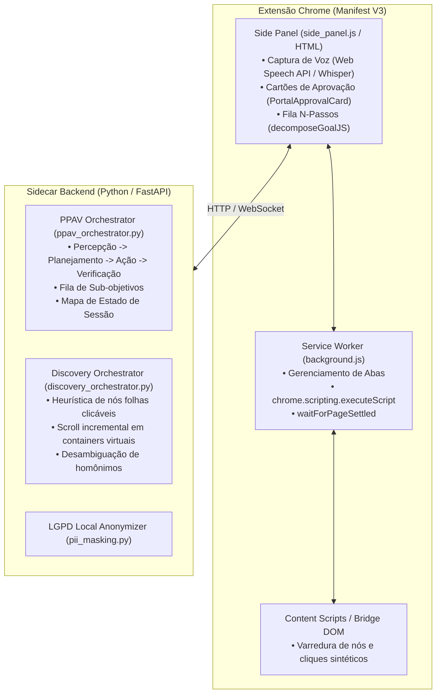

# 📄 Documento de Arquitetura & Convergência: Teacher AI + Browser Harness

**Destinatário:** Claude (Engenheiro de Software & Arquiteto de Sistemas)  
**Autor:** Equipe Teacher AI  
**Data:** 18 de Setembro de 2026  
**Objetivo:** Apresentar a arquitetura atual do **Teacher AI**, dissecar o código-fonte do **Browser Harness** (`browser-use/browser-harness`) extraído localmente, e solicitar uma proposta arquitetural para integrar o Browser Harness como o motor de execução (músculo) do Teacher AI, eliminando definitivamente problemas de ciclo de vida, transição de páginas e automação "one-step".

---

## 1. Visão Geral e Propósito do Teacher AI

O **Teacher AI** é um assistente pedagógico desenhado para professores da educação básica e técnica. Ele permite que o professor interaja com portais educacionais complexos (ex: **Machado Sobrinho**, **i-Educar**, **iDiário**) utilizando comandos de voz naturais ou texto, eliminando atrito burocrático e garantindo conformidade rigorosa com a **LGPD**.

### Principais Casos de Uso:
- *"Lançar presença para a turma do 3º ano B"*
- *"Ver perfil do aluno João Silva e verificar histórico de faltas"*
- *"Preencher o diário de classe da disciplina de História"*

### Restrições Críticas de Negócio:
1. **Diretiva 0-Tester (Honestidade Máxima):** O agente **nunca** pode alucinar sucesso ou mascarar falhas. Ações de escrita exigem confirmação explícita do professor via `PortalApprovalCard`.
2. **Conformidade LGPD:** Nomes de alunos, CPFs e dados sensíveis são mascarados e tratados localmente (`pii_masking.py`).
3. **Público Não-Técnico:** Professores não usam terminal nem configuram variáveis de ambiente; a experiência de uso deve ser fluida e amigável.

---

## 2. Raio-X da Arquitetura Atual do Teacher AI

O Teacher AI opera atualmente como uma aplicação híbrida composta por uma **Extensão Chrome (Manifest V3)** e um **Backend Sidecar (Python/FastAPI)**.



### Onde dói: O Problema Crônico do "One-Step"
Recentemente, enfrentamos o seguinte sintoma relatado:
> *"Ele continua one-step, recebendo ordens apenas acessando a segunda página."*

**Causa Raiz Identificada:**
1. **Ciclo de Vida do Manifest V3:** No modelo MV3, os Content Scripts são efêmeros. Quando uma ação clica em um botão que navega para uma nova página (ou recarrega a URL), o script injetado na aba é **destruído**.
2. **Perda do Fio da Meada:** O background da extensão tenta sincronizar o término da navegação (`chrome.tabs.onUpdated` com `status === 'complete'`), mas em SPAs (Single Page Applications) o DOM muda dinamicamente via AJAX sem recarga de página completa. O script do passo seguinte roda cedo demais (contra a página antiga) ou tarde demais (perdendo referências), falha silenciosamente e encerra o fluxo, obrigando a professora a emitir um novo comando para continuar.

---

## 3. Raio-X do Browser Harness (`browser-use/browser-harness`)

O repositório do **Browser Harness** (extraído localmente em `C:\Users\rafae\OneDrive\Desktop\browser-harness-main`) foi analisado em detalhes. Ele é uma ferramenta construída pela equipe do *Browser Use* com a filosofia de fornecer uma camada extremamente fina, resiliente e direta sobre o **Chrome DevTools Protocol (CDP)**.

### Estrutura de Arquivos Inspecionada:
```text
browser-harness-main/
├── src/
│   ├── mcp_server.py                 # Servidor MCP sobre stdio
│   └── browser_harness/
│       ├── daemon.py                 # Processo background persistente CDP WebSocket
│       ├── _ipc.py                   # Camada de transporte IPC (TCP loopback no Win)
│       ├── helpers.py                # Primitivas de automação (click, type, wait, etc.)
│       ├── admin.py                  # Ciclo de vida, --doctor, detecção de instâncias
│       ├── recorder.py               # Gravação de vídeo/trilhas de execução
│       └── paths.py                  # Resolução de diretórios de runtime e workspace
├── agent-workspace/
│   ├── agent_helpers.py              # Hot-reload de helpers em tempo de execução
│   └── domain-skills/                # Habilidades específicas por domínio web
├── interaction-skills/               # Guias para iframes, dialogs, upload, shadow-dom
└── SKILL.md                          # Diretivas completas para agentes autônomos
```

### Principais Destaques Técnicos do Browser Harness:

#### A. Daemon Persistente com IPC Seguro (`daemon.py` & `_ipc.py`)
- O daemon roda como um processo Python em segundo plano. Ele se conecta uma única vez ao WebSocket do Chrome (`Target.attachToTarget`) e atua como intermediário síncrono/assíncrono.
- **No Windows:** Utiliza socket TCP em `127.0.0.1`. Para evitar brechas de segurança em que processos não autorizados controlem o navegador, o daemon gera um token criptográfico hexadecimal (`token_hex`) gravado em arquivo restrito. Cada chamada IPC valida obrigatoriamente esse token.
- **Detecção Automática do Chrome:** Lê diretamente o arquivo `DevToolsActivePort` nos perfis do usuário (`%LOCALAPPDATA%\Google\Chrome\User Data\DevToolsActivePort`), descobrindo automaticamente a porta e o caminho GUID do WebSocket (`ws://127.0.0.1:{port}{ws_path}`). Suporta Chrome, Chrome Canary, Edge e Brave.

#### B. Operação em Segundo Plano Sem Roubo de Foco
- Não traz o Chrome para a frente do usuário (`activate_tab` desabilitado por padrão).
- Diferencia `switch_tab(target)` (muda o `sessionId` no CDP) de `activate_tab(target)` (que forçaria a janela para o primeiro plano). O professor pode continuar usando o computador enquanto o agente atua em outra aba.
- Marca visualmente a aba controlada adicionando o emoji `🐴 ` ao início do `document.title` sem quebrar o DOM.

#### C. Percepção Semântica via Árvore de Acessibilidade (AXTree)
- Em vez de seletores CSS frágeis, o Harness prioriza a árvore de acessibilidade nativa:
  ```python
  nodes = cdp("Accessibility.getFullAXTree")["nodes"]
  # Extrai nós com role semântico (button, combobox, link) e calcula o centroide:
  box = cdp("DOM.getBoxModel", backendNodeId=nid)["model"]["content"]
  x, y = sum(box[0::2]) / 4, sum(box[1::2]) / 4
  click_at_xy(x, y)
  ```
- O clique via `Input.dispatchMouseEvent(x, y)` atua no nível do **compositor gráfico**, furando Shadow DOM, iframes cross-origin e elementos com z-index complexo.

#### D. Digitação Nativa à Prova de Frameworks Reativos (`fill_input`)
Em React/Vue/Angular, definir `element.value = "..."` não atualiza o estado interno. O Harness implementa uma sequência de 4 etapas:
1. `e.focus()` no elemento.
2. Limpeza com atalho real do SO: envia `Ctrl+A` (Windows/Linux) ou `Cmd+A` (macOS) usando códigos de tecla virtuais Win32 reais (`windowsVirtualKeyCode: 65`), seguido de `Backspace`.
3. Digitação física caractere a caractere com `keyDown`, `char` e `keyUp`.
4. Disparo sintético de eventos com propagação:
   ```javascript
   e.dispatchEvent(new Event('input', { bubbles: true }));
   e.dispatchEvent(new Event('change', { bubbles: true }));
   ```

#### E. Sincronização Precisa com `wait_for_network_idle`
- Monitora eventos `Network.requestWillBeSent`, `Network.loadingFinished` e `Network.loadingFailed` do CDP.
- **Filtro de Sessão Crucial:** Filtra eventos pelo `session_id` da aba ativa, impedindo que requisições de fundo de outras abas (ex: SSE, streaming, polling) causem falsos travamentos.

#### F. Extensibilidade em Runtime (`agent-workspace/agent_helpers.py`)
- O `helpers.py` carrega o arquivo `agent_helpers.py` via `importlib.util.spec_from_file_location` dinamicamente. Um agente pode escrever uma função específica para um portal e usá-la imediatamente sem reiniciar o daemon.

---

## 4. Por Que o Browser Harness é o "Músculo" Perfeito para o Teacher AI?

| Desafio no Teacher AI | Como o Browser Harness Resolve |
| :--- | :--- |
| **Queda de contexto ao mudar de página ("one-step")** | O Python mantém a conexão CDP persistente. Mudar de URL não encerra o script nem reinicia o daemon. O agente chama `wait_for_load()` / `wait_for_network_idle()` e continua imediatamente para o próximo passo. |
| **Campos de formulários que não salvam no diário** | O `fill_input()` dispara eventos de teclado Win32 reais e sintetiza `input`/`change` com `bubbles: true`, forçando qualquer framework a atualizar o estado. |
| **Botões escondidos em iframes ou containers virtuais** | Coordenadas extraídas via `Accessibility.getFullAXTree` + `DOM.getBoxModel` executadas por `Input.dispatchMouseEvent` operam no nível do compositor. |
| **Professor sendo interrompido na tela** | O agente roda em segundo plano na aba com a marca `🐴 `, sem roubar o foco da janela ativa do professor. |

---

## 5. Questões Arquiteturais para o Claude Analisar e Desenhar

Gostaríamos que você, Claude, avaliasse este cenário e projetasse a **arquitetura de convergência** ideal entre o Teacher AI e o Browser Harness, respondendo às seguintes diretrizes:

### Questão 1: Arquitetura do Pipeline Integrado (Frontend $\leftrightarrow$ Backend $\leftrightarrow$ Chrome)
Como desenhar a comunicação de modo que a professora continue utilizando a interface amigável do **Side Panel da Extensão Chrome** (com microfone por voz e cartões visuais de aprovação), enquanto a **execução mecânica** no portal é transferida integralmente para o **Browser Harness no Sidecar Python**?
- O SidePanel deve falar com o Sidecar FastAPI via WebSocket / SSE?
- Qual o papel residual da extensão Chrome se os cliques e digitações forem feitos via CDP? (Apenas captura de áudio, exibição do chat e overlay visual?)

### Questão 2: Integração com o Loop PPAV (`ppav_orchestrator.py`)
No Teacher AI, temos o loop PPAV (Percepção $\rightarrow$ Planejamento $\rightarrow$ Ação $\rightarrow$ Verificação).
- Como adaptar o `PPAVOrchestrator` e o `DiscoveryOrchestrator` do Teacher AI para consumirem os métodos do `helpers.py` (`click_at_xy`, `fill_input`, `wait_for_network_idle`, `cdp`) em vez de executarem scripts injetados via `chrome.scripting`?
- Como manter a "Diretiva 0-Tester" (pausa para confirmação do usuário antes de ações de escrita via `PortalApprovalCard`) dentro de um loop CDP assíncrono?

### Questão 3: Experiência de Inicialização e Conexão no Chrome (UX do Professor)
O Browser Harness conecta via CDP (`--remote-debugging-port` ou `chrome://inspect/#remote-debugging`).
- Sabendo que o Teacher AI já possui um script `abrir-chrome-cdp.bat` que inicia o Chrome na porta 9222, qual é a forma mais transparente e amigável para o professor iniciar o sistema sem atrito ou prompts assustadores de segurança?
- Como o `admin.py` / `daemon.py` do Harness pode ser empacotado junto com o sidecar FastAPI para subir como um serviço único?

### Questão 4: Plano de Migração Passo a Passo
Qual seria o roteiro gradual e seguro para testar essa migração (por exemplo, criando um driver adaptador CDP que implemente a interface de ações do Teacher AI) sem quebrar a suíte atual de testes do projeto?

---

*Fim do Documento.*
